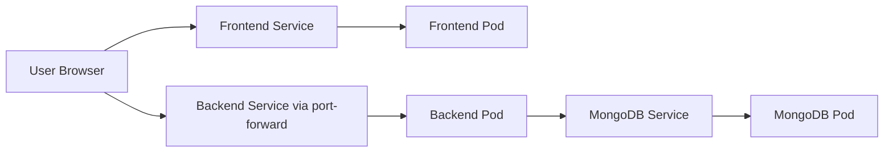

# Kubernetes Implementation for the Day 05 and 06 3-Tier App

This guide explains how to deploy the existing Day 05 and 06 application on Kubernetes as a simple 3-tier setup:

- Frontend tier: React app from the `frontend/Dockerfile`
- Backend tier: Node.js API from the `backend/Dockerfile`
- Database tier: MongoDB from the Docker Compose setup

The goal is to keep this easy for a demo while still matching the code in this folder.

## 1. What the Current Code Already Does

The local Docker Compose file runs three containers independently:

1. Frontend on port `5173`
2. Backend on port `5000`
3. MongoDB on port `27017`

The backend reads these environment variables:

- `PORT`
- `MONGODB_URI`
- `JWT_SECRET`

The frontend now calls the backend through the `/api` path, so the same code can work in ECS with ALB path routing or locally through the Vite dev proxy.

## 2. Kubernetes Architecture for the Demo



This is the simplest way to demonstrate the flow without changing the application code.

## 3. Prerequisites

Install these tools first:

- Docker Desktop with Kubernetes enabled, or Minikube
- `kubectl`
- A terminal

If you use Minikube, start the cluster:

```bash
minikube start
```

Check the cluster status:

```bash
kubectl get nodes
```

## 4. Create a Namespace

Using a namespace keeps the demo resources together.

Create a file named `namespace.yaml`:

```yaml
apiVersion: v1
kind: Namespace
metadata:
  name: day05-06-demo
```

Apply it:

```bash
kubectl apply -f namespace.yaml
```

## 5. Deploy MongoDB

MongoDB is the database tier. For a local teaching demo, a Deployment is enough.

Create a file named `mongo.yaml`:

```yaml
apiVersion: apps/v1
kind: Deployment
metadata:
  name: mongo
  namespace: day05-06-demo
spec:
  replicas: 1
  selector:
    matchLabels:
      app: mongo
  template:
    metadata:
      labels:
        app: mongo
    spec:
      containers:
        - name: mongo
          image: mongo:latest
          ports:
            - containerPort: 27017
---
apiVersion: v1
kind: Service
metadata:
  name: mongo
  namespace: day05-06-demo
spec:
  selector:
    app: mongo
  ports:
    - port: 27017
      targetPort: 27017
  type: ClusterIP
```

Apply it:

```bash
kubectl apply -f mongo.yaml
```

Check the Pod and Service:

```bash
kubectl get pods -n day05-06-demo
kubectl get svc -n day05-06-demo
```

## 6. Deploy the Backend API

The backend is the middle tier. It connects to MongoDB through the service name `mongo`.

Create a file named `backend.yaml`:

```yaml
apiVersion: apps/v1
kind: Deployment
metadata:
  name: backend
  namespace: day05-06-demo
spec:
  replicas: 1
  selector:
    matchLabels:
      app: backend
  template:
    metadata:
      labels:
        app: backend
    spec:
      containers:
        - name: backend
          image: your-backend-image:latest
          ports:
            - containerPort: 5000
          env:
            - name: PORT
              value: "5000"
            - name: MONGODB_URI
              value: "mongodb://mongo.day05-06-demo.svc.cluster.local:27017/mern-dashboard"
            - name: JWT_SECRET
              value: "supersecretjwtkey_for_dashboard_app"
---
apiVersion: v1
kind: Service
metadata:
  name: backend
  namespace: day05-06-demo
spec:
  selector:
    app: backend
  ports:
    - port: 5000
      targetPort: 5000
  type: ClusterIP
```

Replace `your-backend-image:latest` with a real image name if you push the backend to a registry.

Apply it:

```bash
kubectl apply -f backend.yaml
```

Check the backend:

```bash
kubectl get pods -n day05-06-demo
kubectl logs -n day05-06-demo deploy/backend
```

## 7. Deploy the Frontend

The frontend is the top tier. In this codebase it runs the Vite dev server on port `5173` during local development and serves static files from Nginx in production.

Create a file named `frontend.yaml`:

```yaml
apiVersion: apps/v1
kind: Deployment
metadata:
  name: frontend
  namespace: day05-06-demo
spec:
  replicas: 1
  selector:
    matchLabels:
      app: frontend
  template:
    metadata:
      labels:
        app: frontend
    spec:
      containers:
        - name: frontend
          image: your-frontend-image:latest
          ports:
            - containerPort: 5173
---
apiVersion: v1
kind: Service
metadata:
  name: frontend
  namespace: day05-06-demo
spec:
  selector:
    app: frontend
  ports:
    - port: 5173
      targetPort: 5173
  type: ClusterIP
```

Apply it:

```bash
kubectl apply -f frontend.yaml
```

## 8. Build the Images Locally

Because the project already has separate Dockerfiles, build the images from each folder.

Backend:

```bash
cd day-05-and-06/backend
docker build -t your-backend-image:latest .
```

Frontend:

```bash
cd ../frontend
docker build -t your-frontend-image:latest .
```

If you are using Minikube, load the images into the cluster after building them:

```bash
minikube image load your-backend-image:latest
minikube image load your-frontend-image:latest
```

## 9. Run the Demo Locally with Port-Forwarding

For this specific code, the easiest workflow is:

1. Run the frontend in Kubernetes.
2. Run the backend in Kubernetes.
3. Keep MongoDB internal.
4. Port-forward the backend and frontend to your laptop.

Start backend port-forwarding:

```bash
kubectl port-forward -n day05-06-demo service/backend 5000:5000
```

Start frontend port-forwarding in another terminal:

```bash
kubectl port-forward -n day05-06-demo service/frontend 5173:5173
```

Open the app in the browser:

```text
http://localhost:5173
```

Because the React code uses the `/api` path, Vite forwards it to the local backend in development, and ECS can route the same path to the backend service in production.

## 10. Demo Workflow 

Sequence:

1. Build two separate images from the two Dockerfiles.
2. Create a namespace for isolation.
3. Deploy MongoDB first.
4. Deploy the backend and connect it to MongoDB using the service name.
5. Deploy the frontend.
6. Port-forward backend and frontend to the local machine.
7. Open the app in the browser and test registration or login.

## 11. Useful Commands

Show all resources:

```bash
kubectl get all -n day05-06-demo
```

See events and Pod status:

```bash
kubectl describe pod -n day05-06-demo <pod-name>
```

Check service details:

```bash
kubectl describe svc -n day05-06-demo backend
kubectl describe svc -n day05-06-demo frontend
kubectl describe svc -n day05-06-demo mongo
```

Remove everything when done:

```bash
kubectl delete namespace day05-06-demo
```

## 12. Important Note for Production

This guide is intentionally simple for learning.

For a real production setup, the frontend should not call a hardcoded localhost backend directly. Instead, you would usually:

- Put the backend behind an Ingress or LoadBalancer
- Use environment-based API URLs in the frontend
- Add persistent storage for MongoDB with a PVC
- Add readiness and liveness probes

## 13. Summary

This Kubernetes version may match your current Docker Compose design. Check your version before you implement:

- Frontend container from `frontend/Dockerfile`
- Backend container from `backend/Dockerfile`
- MongoDB container from the database service in the compose file

It gives you a clear path from Docker Compose to Kubernetes without changing the application structure first.